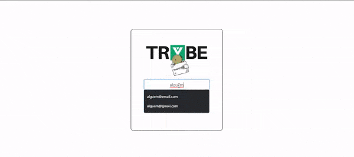

# Boas vindas ao repositório do projeto Trybe Wallet!

---


# Skills
In this project, you need to able to:

  * Create a Redux Store in React app;

  * Create Redux reducers in React app;
  
  * Create Redux actions in React app;
  
  * Create Redux dispatchers no Redux in react app;  
  
  * Connect Redux with React components;
  *
  * Create async actions in React apps where you have a Redux.

---

# Deliverable

## What you should develop

In this project, you will develop a virtual wallet to control expenses including exchange rates, and the app should allow the customer to:
  - Add, remove and edit an expense;
  - To view the stored expenses in a table;
  - To view total amount of the expenses to a chosen exchange;

## Workflow

You should develop a React app with Redux as state manager.

In this application, it will be possible to manager basic flows of build and manipulate a Redux state.

---
# How to Do

In this application you MUST use the global state below: 

```
{
  user: {
    email: '',
  },
  wallet: {
    currencies: [],
    expenses: []
  }
}
```
---

## API

Your application will consume the endpoint below to get the enchange information:

- https://economia.awesomeapi.com.br/json/all


# Project requirements

## Login Page

Create a page to identify the user, with email and password. It will be the inicial page of your app.

  

1. Create the login page with the following fields and informations:

  * The path to this page must be ‘/’.

  * You should create a field to the user to input the email and one for the password.<br>
  
  * Use the following data-testid `data-testid="email-input"` for the email, and `data-testid="password-input"` for the password.

  * Creat a button with the text ‘Entrar’.

  * You should validate the email and the password following the format below. The button should be disable as long as the information is not valid: 

    * The email should follow this format: 'alguem@alguem.com'.

    * The passoword length should be 6 or more characters.

  * Save the email in app state, using the key ***email***, as soon as the user login.

  * The path should be changed to '/carteira' after the click in the button '**Entrar**'.

  What will be validate:
  ```
  - The path of this page should be "/"
  - The page should have a field to the email and another to the password
  - There should be a text 'Entrar' button
  - The validate of the email and the password acording to the requirement
  - Save the email in the app state in the login action
  - The path should be '/carteira' in the login action
  ```

### Wallet page

Create a page to manager the wallet in several exchanges, and show the total of the expenses in a pattern exchange.<br>
This page should be rendered by a component called ***Wallet***.

  

### To setUp your page 

2. Create the wallet page following the settings bellow:

  * The path should be `/carteira`

  * The component name should be Wallet and be in the folder `src/pages` at file `Wallet.js`

  What will be validate:
  ```
  - The path of this page should be "/carteira"
  - The component name should be Wallet and be in the folder `src/pages` at file `Wallet.js`
  ```

### Header

3. Create a header for the wallet page following the settings bellow:

  * An element should display the user email.

    * Use `data-testid="email-field"`.

  * An element should display the total amount of the expenses according to expenses list.

    * Use `data-testid="total-field"`.

    * The initial state should be `0`

  * An element should display the exchange chosen, that in this case will be 'BRL'.

    * Use `data-testid="header-currency-field"`.
  
    What will be validate:
  ```
  - An element with the user email.
  - An element with total amount of the expenses.
  - An element to display the current exchange "BRL".
  ```

### Add expense form 

4. Create a form to add a new expense following the settings bellow:

  * A field to add the expense value.

    * Use `data-testid="value-input"`.

  * A field to add the expense description.

    * Use `data-testid="description-input"`.

  * A field to chose the exchange to be used.

    * Use `data-testid="currency-input"`.

    * This field should be a  dropdown. The options should be: 'USD', 'CAD', 'EUR', 'GBP', 'ARS', 'BTC', 'LTC', 'JPY', 'CHF', 'AUD', 'CNY', 'ILS', 'ETH' e 'XRP'.

    * The values of the field should be required to an API.

      * The *data-testid* should contain the exchange as following example `data-testid="USD"`.

      * The endpoint should be: https://economia.awesomeapi.com.br/json/all .

      * The options should not include 'USDT'. 
    
  * A field to chose the payment method.

    * Use `data-testid="method-input"`.

    * This field should be a  dropdown. The options should be: 'Dinheiro', 'Cartão de crédito' e 'Cartão de débito'.

  * A field to select the category(tag) of the expense.

    * This field should be a  dropdown. The options should be: 'Alimentação', 'Lazer', 'Trabalho', 'Transporte' e 'Saúde'.

    * Use `data-testid="tag-input"`.

    * At the click event, the button should call the API to get the most updated exchange.

  * A button with the text \'Adicionar despesa\' that saves the expense in the global state and update the total amount in the header.

    * The button "Adicionar despesa" should dispatch the following actions:
    
    * The values of the fields should be saved in global state, in the key ***expenses***, in an array with the expenses:

      * The expense id should be an index, starting in 0.

      * You should save the exchange rate information you asked for the API.

    * After adding the expense, update the total amount of expenses, in the `data-testid="total-field"` element

    The expenses key will following the sample bellow: 
    ```
    expenses: [{
      "id": 0,
      "value": "3",
      "description": "Hot Dog",
      "currency": "USD",
      "method": "Dinheiro",
      "tag": "Alimentação",
      "exchangeRates": {
        "USD": {
          "code": "USD",
          "name": "Dólar Comercial",
          "ask": "5.6208",
          ...
        },
        "CAD": {
          "code": "CAD",
          "name": "Dólar Canadense",
          "ask": "4.2313",
          ...
        },
        "EUR": {
          "code": "EUR",
          "name": "Euro",
          "ask": "6.6112",
          ...
        },
        "GBP": {
          "code": "GBP",
          "name": "Libra Esterlina",
          "ask": "7.2498",
          ...
        },
        "ARS": {
          "code": "ARS",
          "name": "Peso Argentino",
          "ask": "0.0729",
          ...
        },
        "BTC": {
          "code": "BTC",
          "name": "Bitcoin",
          "ask": "60299",
          ...
        },
        "LTC": {
          "code": "LTC",
          "name": "Litecoin",
          "ask": "261.69",
          ...
        },
        "JPY": {
          "code": "JPY",
          "name": "Iene Japonês",
          "ask": "0.05301",
          ...
        },
        "CHF": {
          "code": "CHF",
          "name": "Franco Suíço",
          "ask": "6.1297",
          ...
        },
        "AUD": {
          "code": "AUD",
          "name": "Dólar Australiano",
          "ask": "4.0124",
          ...
        },
        "CNY": {
          "code": "CNY",
          "name": "Yuan Chinês",
          "ask": "0.8278",
          ...
        },
        "ILS": {
          "code": "ILS",
          "name": "Novo Shekel Israelense",
          "ask": "1.6514",
          ...
        },
        "ETH": {
          "code": "ETH",
          "name": "Ethereum",
          "ask": "5184",
          ...
        },
        "XRP": {
          "code": "XRP",
          "name": "Ripple",
          "ask": "1.4",
          ...
        }
      }
    }]
    ```

  What will be validate:
  ```
  - A field to add the expense value
  - A field to add the expense description
  - A field to select the exchange of the expense
  - A field to select the payment method of the expense
  - A field to select the expense category of teh expense
  - A button that saves the expenses informations in global state ans update the sum in the header
  ```

### Expenses table

5. Creat a table with the expenses with the following settings bellow:

  * The table header should have the following tags Descrição, Tag, Método de pagamento, Valor, Moeda, Câmbio utilizado, Valor convertido and Moeda de conversão

  * The table should use the global state of the app, in the 'expenses' key in the 'wallet' reducer.

    * The field of the exchange and exchange rates should have the name of the exchange. So, in instead of 'USD' or 'EUR', should be "Dólar Comercial" and "Euro".

    * By deafult, the exchange rate field should display 'Real'

    * Pay attention to the decimal places. The should display 2 places after the comma. 

    * Follow the pattern `0.00`
    
 What will be validate:
```
- The table head should be Descrição, Tag, Método de pagamento, Valor, Moeda, Câmbio utilizado, Valor convertido and Moeda de conversão.
- The table information should be provided by the reducer 'wallet'.
```

6. Creat a delete button following the seetings bellow:

    

  * The button should be the last item of the list, and use `data-testid="delete-btn"`.

  * On click event, the button deletes the table line, updating the global state.

What will be validate:
```
- The button have the attributes asked.
- The button click should delete the expense.
```

### Bonus

7. Create a button to edit a expense following the settings bellow:

    

  * The button should be inside the last item of the list, using `data-testid="edit-btn"`

  * On click event, the button enables a form to edit the table line.The expense should be updated, as long as the global state.

    * The form should use the same data-testids of the add expense form. You can use it as well.

    * The button to submit text should be "Editar despesa"

    **Attention**: the exchange rate should be the same as used when the expense was saved.

  What will be validate:
  ```
  - The button should be inside the laste item of the table and use `data-testid="edit-btn"
  - On click event, the button should enable a form.
  ```

---


